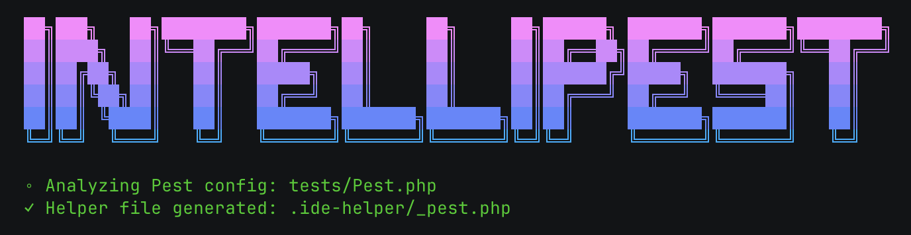

# IntelliPest

> Better IDE intelligence for the [PestPHP testing framework](https://pestphp.com/).

- 🧠 Smart helper file generation for PestPHP
- 🫵🏻 Supports your custom test cases
- 🧩 Pure PHP & framework agnostic

> [!IMPORTANT]
> This project is in beta.

## Introduction

IntelliPest is a CLI tool that generates a helper file based on your own Pest setup.

This assists your IDE or coding agent to better understand your tests, enabling full autocompletion and error checking for [compatible language servers](#compatibility).

## Quick Start

For standard Pest setups with the `Pest.php` configuration file located in `./tests/Pest.php`, you can follow these steps.
If your `Pest.php` is located somewhere else, see the [configuration section](#configuration) below.

1. Install the package via composer:

```bash
composer require ace-of-aces/intellipest
```

2. Run this command to generate the helper file:

```bash
./vendor/bin/intellipest
```



3. If the command ran successfully, you should be all set! You may have to restart your LSP for it to register the helper file.

## Configuration

IntelliPest can be configured through flags to the `intellipest` command.

### `--config` / `-c`

Specify the path to the `Pest.php` configuration file. Default: `tests/Pest.php`.

### `--output` / `-o`

Specify the path to write the generated IDE helper file. Default: `.ide-helper/_pest.php`.

> [!NOTE]
> You may also set the output directory via the `INTELLIPEST_OUTPUT_DIR` environment variable.

### `--no-expectation-helpers`

Don't generate helper methods for Pest's built-in expectations in the helper file.

> [!NOTE]
> Some LSPs like [Intelephense Premium](https://intelephense.com/) support the `@mixin` PHPDoc tag, which is used in Pest's source code, making these helper methods redundant for those users.

### `--shush` / `-s`

Don't show the (beautiful) header and footer in the console output 😔

### `--silent`

Don't output **any** console messages (useful for CI).

## Compatibility

Currently, compatibility has only been tested with the popular [Intelephense](https://intelephense.com/) PHP LSP.

The main requirement for an LSP to benefit from IntelliPest is support for the `@param-closure-this` PHPDoc tag [specified by PHPStan](https://phpstan.org/writing-php-code/phpdocs-basics#callables),
which enables type hinting the `$this` variable inside of test cases.

> [!NOTE]
> For PHPStorm users, we recommend just using the first-party [Pest plugin](https://plugins.jetbrains.com/plugin/14636-pest) by JetBrains.

## Contributing

Whether it's reporting or fixing bugs, contributing new features, or enhancing the documentation, your help is always appreciated. 🙏🏻

[→ Read the Contribution Guidelines](CONTRIBUTING.md)

[→ Open an Issue](https://github.com/ace-of-aces/intellipest/issues)

[→ Submit a Pull Request](https://github.com/ace-of-aces/intellipest/pulls)

## License

Made with ❤️ under the [MIT License](LICENSE.md)
