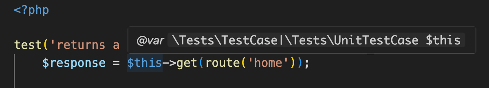

# IntelliPest

> Better IDE intelligence for the [PestPHP testing framework](https://pestphp.com/).

- 🧠 Smart helper file generation for PestPHP
- 🫵🏻 Supports your custom test cases
- 🧩 Pure PHP & framework agnostic

> [!IMPORTANT]
> This project is currently in beta. Features are subject to change.

---

## Introduction

IntelliPest is a CLI tool that generates a helper file based on your own Pest setup.

This assists your IDE or coding agent to better understand your tests, enabling full autocompletion and error checking for [compatible language servers](#compatibility).

## Quick Start

For standard Pest setups with the `Pest.php` configuration file located in `./tests/Pest.php`, you can follow these steps.
If your `Pest.php` is located somewhere else, see the [configuration section](#configuration) below.

### Prerequisites

Make sure your project meets the following requirements:

- PHP 8.3+
- Pest 4.x

### Setup

1. Install the package via composer:

```bash
composer require --dev ace-of-aces/intellipest
```

2. Run this command to generate the helper file:

```bash
./vendor/bin/intellipest
```


3. If the command ran successfully, you should be all set! You may have to restart your LSP for it to register the helper file.

## Configuration

IntelliPest can be configured through flags to the `intellipest` command.

### `--config` / `-c`

Specify the path to the `Pest.php` configuration file. Default: `tests/Pest.php`.

### `--output` / `-o`

Specify the path to write the generated IDE helper file. Default: `.intellipest/_pest-helper.php`.

> [!NOTE]
> You may also set the output directory via the `INTELLIPEST_OUTPUT_DIR` environment variable.

### `--no-expectation-helpers`

Don't generate helper methods for Pest's built-in expectations in the helper file.

> [!NOTE]
> Some LSPs like [Intelephense Premium](https://intelephense.com/) support the `@mixin` PHPDoc tag, which is used in Pest's source code, making these helper methods redundant for those users.

### `--shush` / `-s`

Don't show the (beautiful) header and footer in the console output 😔

### `--silent`

Don't output **any** console messages (useful for CI).

## Compatibility

### LSP compatibility

Currently, compatibility has only been tested with the popular [Intelephense](https://intelephense.com/) PHP LSP.

The main requirement for an LSP to benefit from IntelliPest is support for the `@param-closure-this` PHPDoc tag [specified by PHPStan](https://phpstan.org/writing-php-code/phpdocs-basics#callables),
which enables type hinting the `$this` variable inside of test cases.

> [!NOTE]
> For PHPStorm users, we recommend just using the first-party [Pest plugin](https://plugins.jetbrains.com/plugin/14636-pest) by JetBrains.

### Pest Version compatiblity

Exact API compatibility for minor Pest versions has not been thoroughly tested as of right now. This may improve in future releases.

> [!IMPORTANT]
> IntelliPest currently only supports projects using Pest 4.x

## Known Limitations

IntelliPest is currently unable to accurately reflect the dynamic Test class association of the `$this` variable in test cases determined by the `->in(...)` method in configuration call chains.

### Concrete Example

For a `Pest.php` configuration with different TestCase classes for the `Feature` and `Unit` folders, like this:

```php
pest()->extends(Tests\TestCase::class)
    ->extend(Illuminate\Foundation\Testing\RefreshDatabase::class)
    ->in('Feature');

pest()->extend(Tests\UnitTestCase::class)
    ->in('Unit');
```

The resulting type hint in all test cases will **always** be a union of both TestCase classes, regardless of whether the test is located in `Feature` or `Unit`:



> [!IMPORTANT]
> It's important to be aware of this while writing tests, as suggestions from both TestCase classes will appear on the `$this` variable inside of tests, even though they _might_ not be available (possibly resulting in a runtime exception when called from the wrong context).

### Technical Details

This is due to IntelliPest's helper file approach only being able to override the `@param-closure-this` PHPDoc tag for [Pest's global testing function declarations](https://pestphp.com/docs/writing-tests).

## Under The Hood

IntelliPest leverages the [nikic/PHP-Parser](https://github.com/nikic/PHP-Parser) package in order to parse your `Pest.php` as an AST (Abstract Syntax Tree).

This enables it to extract call chains to Pest's configuration API (namely `pest()`, `uses()`, `expect()`).

Based on these function calls and the arguments you pass to them (mainly TestCase classes and Traits), IntelliPest maps those to an internal data structure.

As a final step, IntelliPest takes all of this analyzed data and generates a PHP helper file with the help of templates.

---

## Contributing

Whether it's reporting or fixing bugs, contributing new features, or enhancing the documentation, your help is always appreciated. 🙏🏻

[→ Read the Contribution Guidelines](CONTRIBUTING.md)

[→ Open an Issue](https://github.com/ace-of-aces/intellipest/issues)

[→ Submit a Pull Request](https://github.com/ace-of-aces/intellipest/pulls)

## License

Made with ❤️ under the [MIT License](LICENSE.md)
